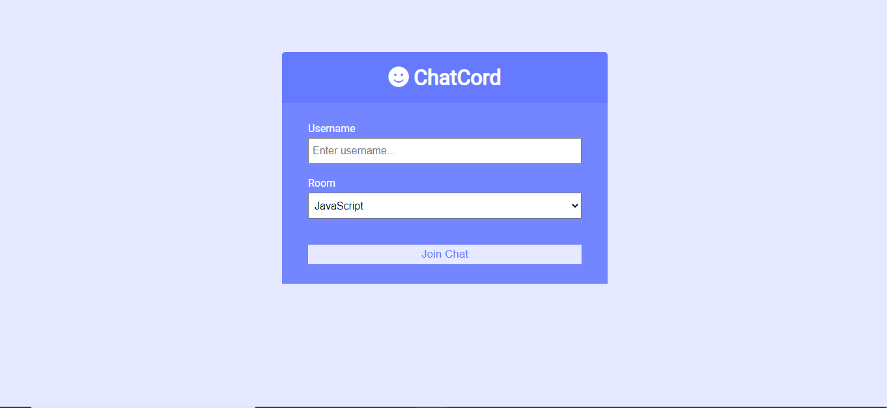
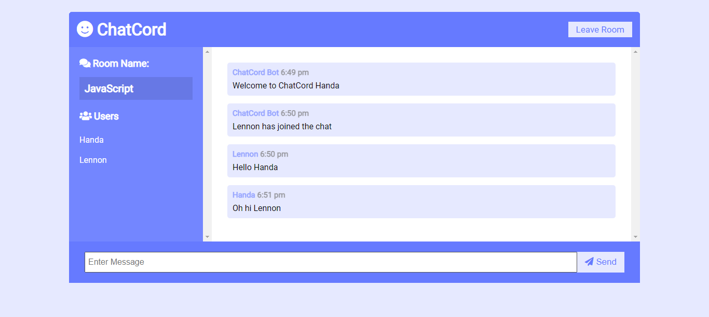

# Chatcord

Realtime chat app with websockets using Node.js, Express and Socket.io with Vanilla JS on the frontend with a custom UI

## Usage

Install all required dependencies

```bash
npm install
```
Run locally at localhost:3000
```bash
npm run dev
```

## Screenshot


